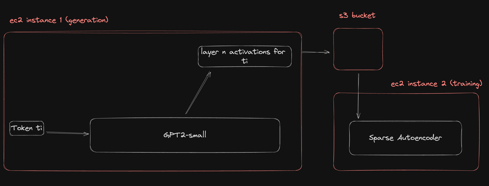

# Training a Sparse Autoencoder on GPT2 in < 35 minutes

## Overview

This codebase is used to:
1. Save LLM activations to S3, i.e.
    1. Spin up a LLM
    2. Select a layer in that LLM
    3. Feed a dataset into the LLM
    4. Save the activations of that layer to S3
2. Use those LLM activations to train a sparse autoencoder quickly on a small GPU, i.e.
    1. Spin up an appropriate AWS ec2 instance
    2. Load the activations from S3
    3. Train a sparse autoencoder on those activations



The way this codebase should *probably* be used is as a parts shop which can be cannibalized for the user's own unholy purposes. It's written to be easier to read and understand at the cost of some generalizability. In particular it can be used as a guide for setting up high throughput s3 tensor reading and writing (see `sache/cache.py`). Installation instructions, tests and usage instructions are included below so users can achieve confidence that the code actually works.

Some more details can be found on the corresponding [lesswrong article](https://www.lesswrong.com/posts/AtJdPZkMdsakLc6mB/training-a-sae-in-less-than-30-minutes-on-16gb-of-vram-using)

## Installation

Install requirements
```bash
pip install -r requirements.txt
```

Add aws credentials to a new file called `.credentials.json` which copies the format of `example.credentials.json`

## Testing

Note: many tests will fail unless the server they run on has an internet connection so make sure you're juiced up.

```bash
python -m pytest
```

## Generating activations

```bash
python scripts/generate.py --bucket_name my_epic_bucket
```

Will start the generation process. The "run name" is the prefix under which the activations will be saved in s3. Note that they are saved in a janky format (raw bytes) to make them quicker to load on the other end. Once saved they must be loaded via `torch.frombuffer` (see `sache/cache.py`). The activations are stored in ~3GB files consisting of (batch_size, sequence_length, hidden_dim) = (1024, 1024, 768) tensors.

Example activations for `gpt2-small` on 678,428,672 tokens are available [here](https://s3.amazonaws.com/lewington-pitsos-sache).
## Deploying a server to AWS

Install terraform, then edit `server.tf` so that the `aws_key_pair.public_key` points to a local public key (which will allow SSH access to the spun-up server.)

Then from the root of this project run

```bash
terraform -chdir=./terraform/environments/production apply
```

This setup is important since loading activations from s3 will be super slow unless the loading sever is deployed inside the same region as the s3 bucket king. Other instance types will mostly also be incredibly slow, see ec2 instance [throughput limits](https://docs.aws.amazon.com/AWSEC2/latest/UserGuide/ec2-instance-network-bandwidth.html) . Once deployed the instance can be SSH'd into and training can commence.

Note: the `aws_instance.ami` has been carefully chosen to make the surprisingly finnicky nvidia actually work, but it will only work inside `us-east-1`. Deployments to other regions will require the equivalent ami for that region.

Unfortunately by default a new AWS account will have a quota of 0 "Running G and VT Instance" CPUs to run the required `g4dn.8xlarge` instance and a quota increase will need to be requested. AWS can be somewhat guarded with their GPU instance quotas, so that may end up being a bit of a hurdle :(

## Training a SAE

This will be horrifically slow unless the training server is inside AWS in the same region as the activations bucket. 

```bash
python scripts/train_sae.py --use_wandb --log_bucket bucket_full_of_karpathy_fanart
```

Using the settings specified in the terraform and loading the `merciless_citadel` activations you will achieve something like 420 mbps throughput, which equates to 300,000,000 tokens in ~35 minutes.

Note that by default we log metrics and histograms locally, to wandb and also s3. See `sache/analysis.ipynb` for how to read the logged data.